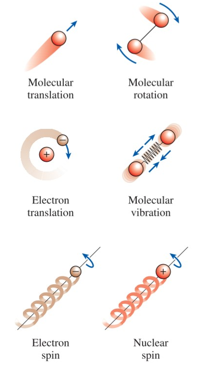

# CH_2

## 1. Forms of Energy

1. Total Energy

   the sum of thermal, mechanical, kinetic, potential, electric, magnetic, chemical, and nuclear

   $$
   e=\frac{E}{m}\text{ (kJ/kg)}
   $$

   - the macroscopic forms of energy
     - kinetic energy
       $$
       KE=\frac{1}{2}mV^2\qquad KE=\frac{1}{2}I\omega^2
       $$
     - potential energy
       $$
       PE=mgz
       $$
   - the microscopic forms of energy
     - translational energy
     - rotational kinetic energy
     - vibrational kinetic energy
     - spin energy
       

2. the expression of E

$$
E=U+KE+PE=U+\frac{1}{2}mV^2+mgz
$$

- for a closed system or a control mass

  $$
  \Delta E= \Delta U
  $$

- for an open system or a control volume

  **mass flow rate**

  $$
  \dot{m}=\rho\dot{V}=\rho A_cV_{avg}
  $$

  **energy flow rate**

  $$
  \dot{E}=\dot{m}e
  $$

3. the forms of energy of interactions

   - a closed system: **Heat Transfer** and **work**
   - a control system: **Heat Transfer**, **work** and **mass flow**

4. Mechanical energy

    **Definition**: the form of energy that can be converted to mechanical work completely and directly by an ideal mechanical device

    $$
    e_{mech} = \frac{P}{\rho}+\frac{V^2}{2}+gz
    $$
## 2. Energy Transfer by Heat

### Heat

defined as the form of energy that is transferred between two systems by virtue of a temperature difference

#### Adiabatic Process

a process during which there is no heat transfer

- well insulated
- no temperature difference

#### Calculation of Heat

$$
Q=\int_{t_1}^{t_2}{\dot{Q}\mathrm{d}t}\qquad Q=\dot{Q}\Delta t
$$

### Work

the energy transfer associated with a force acting through a distance

#### Directional Quantities

both heat and work are directional quantities

- heat transfer to a system and work done by a system(**+/positive**)
- heat transfer from a system and work done on a system(**-/negative**)

### the Similarities between Heat and Work

- both heat and work are boundary phenomena
- systems possess energy, but not heat or work
- both are associated with a process, not a state
- both are path functions