# CH_3

[TOC]

## 3.1 Pure Substance

### Definition

a substance that has a fixed chemical composition throughout

## 3.2 Phases of a Pure Substance

### Intermolecular Model

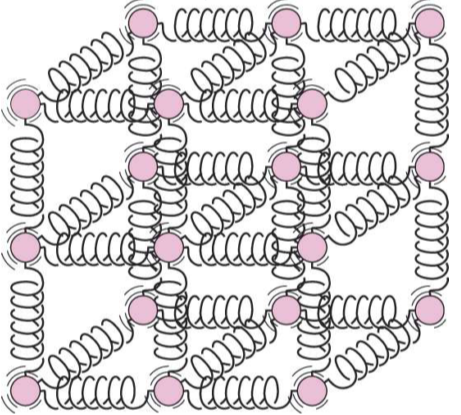

### Solid

**molecules**: in fixed positions

**intermolecular force**: strong

### Liquid

**molecules**: no longer at fixed positions and can rotate and translate freely

**intermolecular force**: weaker

**distance between molecules**: slight increase comparing to solid

_exception on water_

### Gas

**molecules**: orders are nonexistent and move at random

**intermolecular force**: vary small

**Energy Level**: higher than other phases

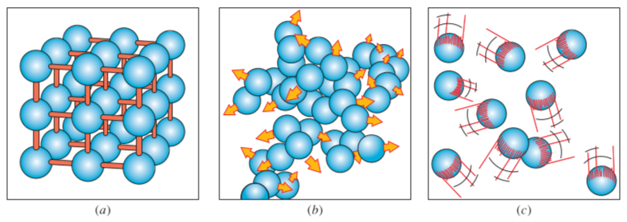

## 3.3 Phase-Change Processes of Pure Substances

### Compressed Liquid and Saturated Liquid

- **compressed liquid**: liquid exists in liquid phase
- **saturated liquid**: liquid about to vaporize
  
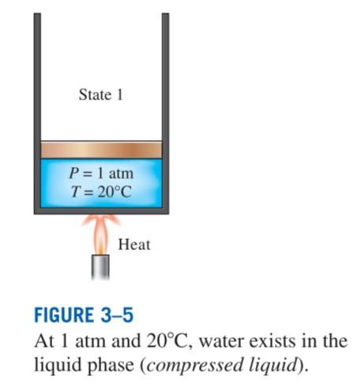

  
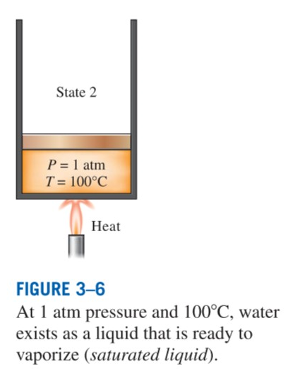

### Saturated Vapor and Superheated Vapor

- **saturated vapor**: vapor is about to condense
- **superheated vapor**: vapor is not about to condense
  
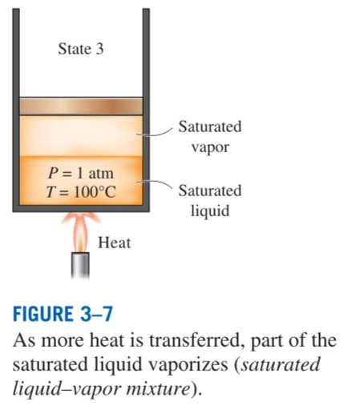

  
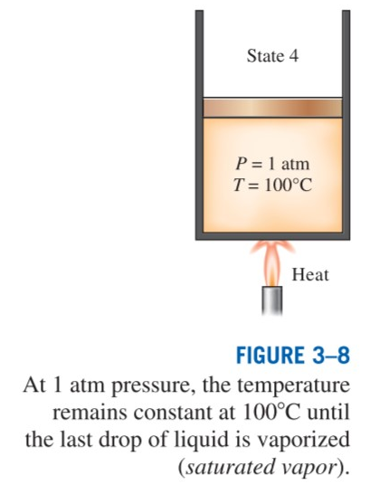

  
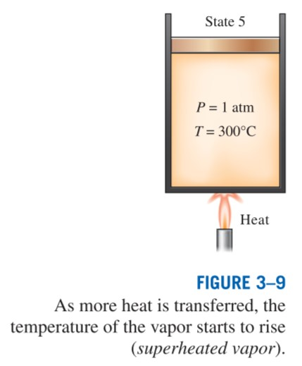

  
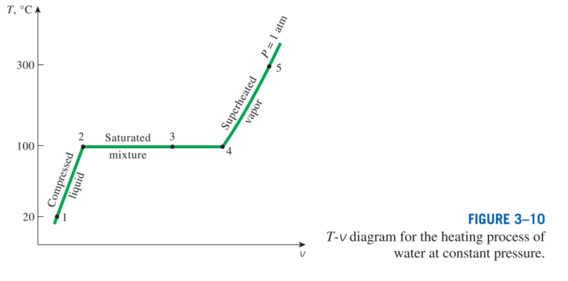

### Saturation Temperature and Saturation Pressure

- Saturation Temperature: $T_{sat}$
- Saturation Pressure: $P_{sat}$
  
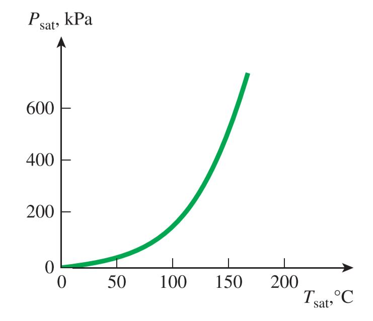

### Latent Heat

- **latent heat of fusion**: the amount of energy absorbed(released) during melting(freezing)
- **latent heat of vaporization**: the amount of energy absorbed(released) during vaporization(condensation)

## 3.4 Property Diagrams for Phase-Change Processes

### The $T-v$ Diagram

**as pressure increased**

|    property     |    status    |
| :-------------: | :----------: |
|    $T_{sat}$    |  $\uparrow$  |
|    $v_{sat}$    |  $\uparrow$  |
| $v_{sat,vapor}$ | $\downarrow$ |
| Horizontal Line | $\downarrow$ |

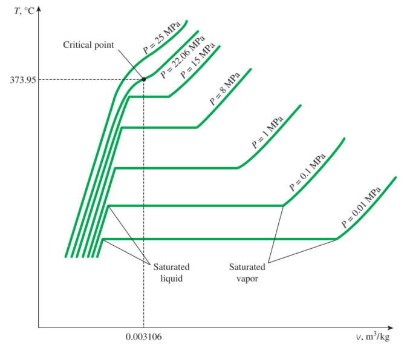

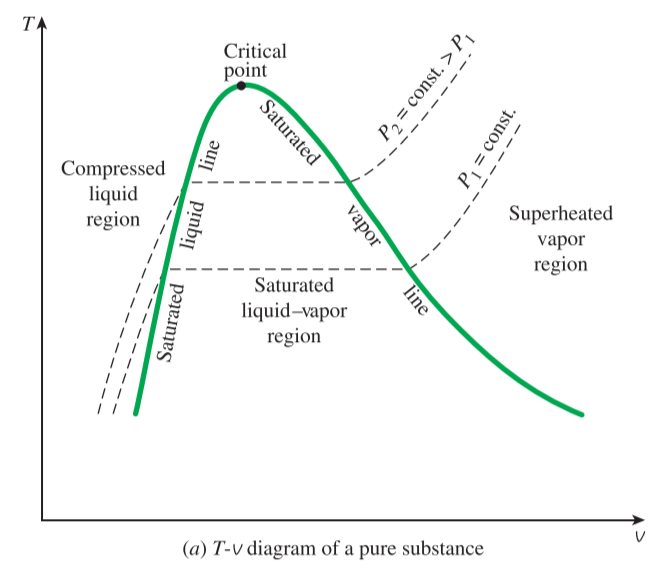

### The $P-v$ Diagram

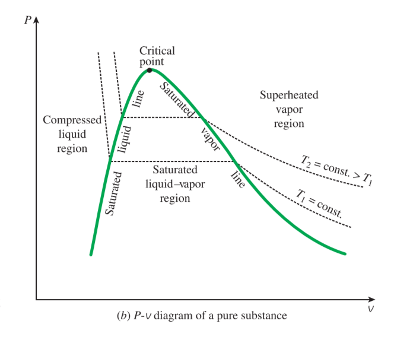

**Extending with Solid Phase**

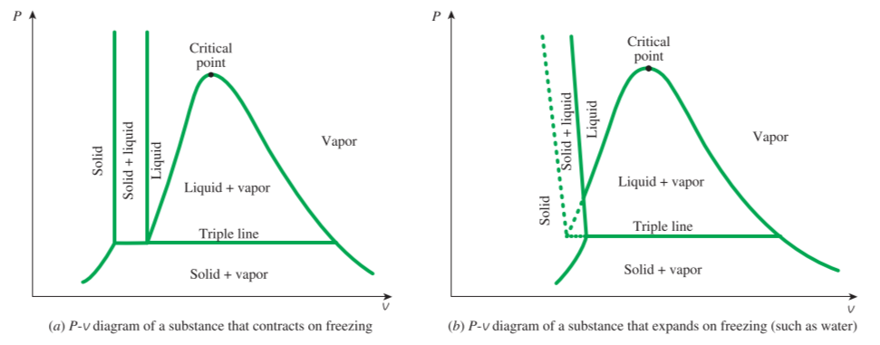

- **Triple Line**: the line formed by triple-phase states
- **Triple Point**: the point appeared by triple line on $P-T$ diagram
- **Sublimation**: the solid turns into vapor at pressures below thw triple point value

### The $P-T$ Diagram

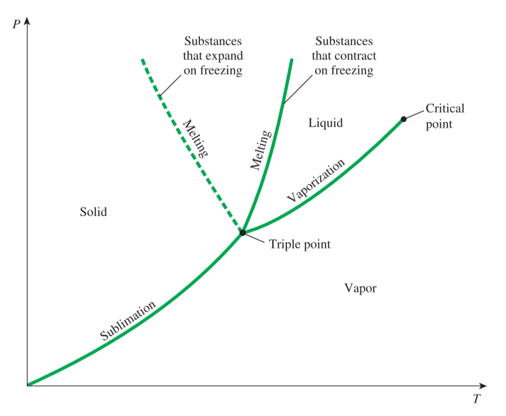

### The $P-v-T$ Surface

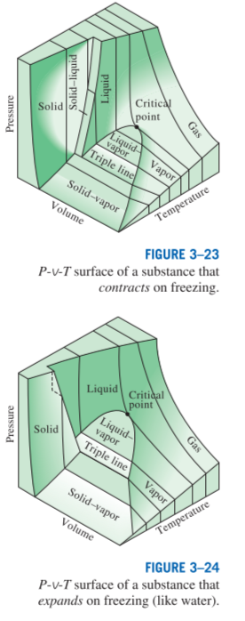

## 3.5 Property Tables

### Enthalpy

which is a combination property

$$
h = u + Pv\text{ (kJ/kg)}\qquad\text{or}\qquad H = U+PV \text{ (kJ)}
$$

### Saturated Liquid and Saturated Vapor States

two forms

|      status       |   table   |
| :---------------: | :-------: |
| Under Temperature | Table A-4 |
|  Under Pressure   | Table A-5 |

- Subscript **g**: saturated vapor
- Subscript **f**: saturated liquid
- Subscript **fg**: the difference between the saturated vapor and saturated liquid values of the same property

$$
v_{fg}=v_g-v_f
$$

### Saturated Liquid - Vapor Mixture

$$
v_{avg}=(1-x)v_f+xv_g\\[2ex]
x = \frac{v_{avg}-v_f}{v_{fg}}\\[2ex]
\Rightarrow \qquad y_{avg}=h_f+xh_{fg}
$$

where y is v, u and h

### Superheated Vapor

|status|given status|
|:--:|:-:|
|$P<P_{sat}$|$T$|
|$T>T_{sat}$|$P$|
|$v>v_{g}$|$P$ or $T$|
|$u>u_{g}$|$P$ or $T$|
|$h>h_{g}$|$P$ or $T$|

### Compressed Liquid

|status|given status|
|:--:|:-:|
|$P>P_{sat}$|$T$|
|$T<T_{sat}$|$P$|
|$v<v_{g}$|$P$ or $T$|
|$u<u_{g}$|$P$ or $T$|
|$h<h_{g}$|$P$ or $T$|

### Reference State and Reference State

Since the relations give the changes in **properties**, not the values of properties at specified states. 

Therefore, we need to **choose a convenient reference state** and assign a value of zero for a convenient property or properties at the state.

For water: the state of saturated liquid at $0.01^\circ{C}$

## 3.6 The Ideal-Gas Equation of State

### Ideal Gas

- the modules of gas are flexible, and everyone is a mass point with no volume
- there is not any force between molecules in addition to molecular collisions

*When $p \to 0$, $v \to \infty$, the real gas can be treated as the ideal gas*

### Ideal-gas Equation of State

$$
P\nu = RT\\[2ex]
PV = nR_uT\\[2ex]
R=\frac{R_u}{M}\\[2ex]
R_u = 8.31447\;\text{kJ/(kmol}\cdot K)\qquad m = MN \text{(kg)}\\[2ex]
\frac{P_1V_1}{T_1}=\frac{P_2V_2}{T_2}
$$

## 3.7 Compressibility Factor

### Compressibility Factor Z

$$
Z=\frac{P\nu}{RT}\qquad P\nu = ZRT\\[3ex]
Z=\frac{\nu_{\text{actual}}}{\nu_{\text{ideal}}}\\[2ex]
P_R=\frac{P}{P_{cr}}\qquad \text{and} \qquad T_R=\frac{T}{T_{cr}}
$$
also called **the principle of corresponding states**
### Generalized Compressibility Chart

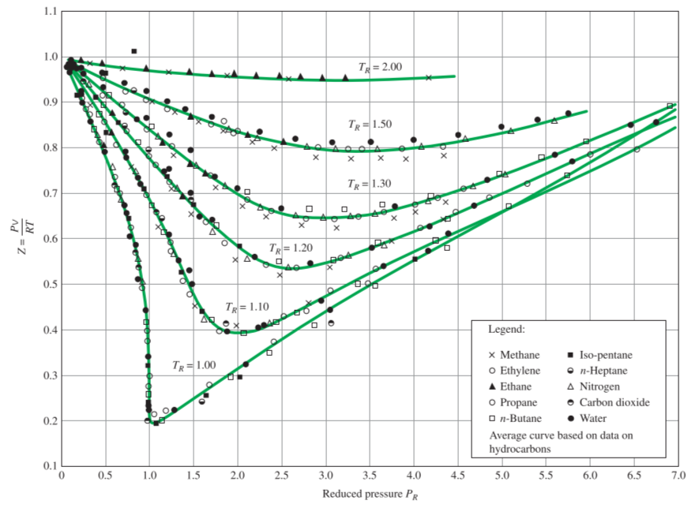

1. At very low pressure ($P_R\ll 1$), gases behave as an ideal gas regardless of temperature
2. At high temperature ($P_R>2$), ideal-gad behavior can be assumed with good accuracy regardless od pressure
3. The deviation of a gad fro, ideal-gad behavior is greatest in the vicinity od critical point.

### The Pseudo-Reduced Specific Volume

$$
    \nu_R=\frac{\nu_{actual}}{RT_{cr}/P_{cr}}
$$

which is defined differently from $P_R$ and $T_R$.

## 3.8 Other Equations of State

### Van Der Waals  Equation of State

$$
(P+\frac{a}{\nu^2})(\nu-b)=RT\\[2ex]
a = \frac{27R^2T_{cr}^2}{64P_{cr}}\qquad\text{and}\qquad b = \frac{RT_{cr}}{8P_{cr}}
$$

### Beattie-Bridgeman Equation of State

$$
P = \frac{R_uT}{\bar{v}^2}(1-\frac{c}{\bar{v}T^3})(\bar{v}+B)-\frac{A}{\bar{v}^2}\\[2ex]
A = A_0(1-\frac{a}{\bar{v}})\qquad \text{and} \qquad B = B_0(1-\frac{b}{\bar{v}})
$$

### Benedict-Webb-Rubin Equation of State

$$
P=\frac{R_uT}{\bar{v}}+(B_0R_uT-A_0-\frac{C_0}{T^2})\frac{1}{\bar{v}^2}+\frac{bR_uT-a}{\bar{v}^3}+\frac{a\alpha}{\bar{v}^6}+\frac{c}{\bar{v}^3T^2}(1+\frac{\gamma}{\bar{v}^2})e^{-\gamma/\bar{v}^2}
$$

### Virial Equation of State

$$
P = \frac{RT}{v}+\frac{a(T)}{v^2}+\frac{b(T)}{v^3}+\frac{c(T)}{v^4}+\frac{d(T)}{v^5}+\cdots
$$