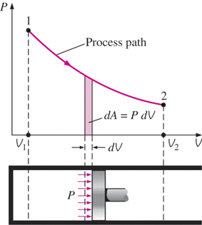
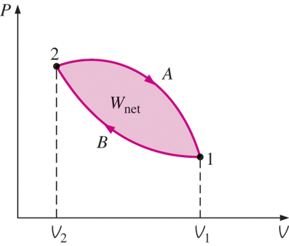
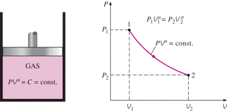

# CH_4

[TOC]

## 4.1 Moving Boundary Work

In a quasi-equilibrium manner

$$
\delta W_b=F\mathrm{d}s=PA\mathrm{d}s=P\mathrm{d}V\\[2ex]
W_b = \int_{1}^{2}{P\mathrm{d}V}\\[2ex]
\text{Area}=A=\int_1^2{\mathrm{d}A}=\int_1^2{P\mathrm{d}V}
$$

### For a Cycle

$$
W_{net}=W_{2-1}-W_{1-2}
$$

### Polytropic Process

$$
PV^n=C\\[2ex]
\Downarrow\\[2ex]
P = C V^{-n}\\[2ex]
W_b = \int_1^2{P\mathrm{d}V}=\int_1^2{CV^{-n}\mathrm{d}V}=C\frac{V_2^{-n+1}-V_1^{-n+1}}{-n+1}=\frac{P_2V_2-P_1V_1}{1-n}\\[3ex]
\text{when } n =1\\[2ex]
W_b = \int_1^2{P\mathrm{d}V} = \int_1^2{CV^{-1}\mathrm{d}V}=PV\ln{\frac{V_2}{V_1}}
$$

## 4.2 Energy Balance for Closed Systems

$$
Q-W = \Delta E_{\text{system}}
$$

## 4.3 Specific Heats

Definition: the energy required to raise the temperature of a unit mass of a substance by one degree

- $c_v$: specific heat at constant volume
- $c_p$: specific heat at constant pressure

$$
c_v=(\frac{\partial{h}}{\partial{T}})_v\\[2ex]
c_p=(\frac{\partial{h}}{\partial{T}})_p\\[2ex]
$$

## 4.4 Internal Energy, Enthalpy, and Specific Heats of Ideal Gases

$$
h=u+RT\qquad
\begin{cases}
    h&=u+Pv\\[2ex]
    Pv&=RT
\end{cases}\\[4ex]
\begin{aligned}
    \mathrm{d}u&=c_v(T)\mathrm{d}T\\[2ex]
    \mathrm{d}h&=c_p(T)\mathrm{d}T\\[2ex]
\end{aligned}
$$

### Specific Heat Relationship of Ideal Gases

$$
\begin{aligned}
    c_p&=c_v+R\\[2ex]
    \bar{c}_p&=\bar{c}_v+R_u\\[2ex]
\end{aligned}\\[2ex]
k=\frac{c_p}{c_v}
$$

## 4.5 Internal Energy, Enthalpy, and Specific Heats of Solids and Liquids

### Internal Energy Changes

$$
\Delta u \approxeq c_{avg}(T_2-T_1)
$$

### Enthalpy Changes

$$
\Delta h =\Delta u +v\Delta P 
$$