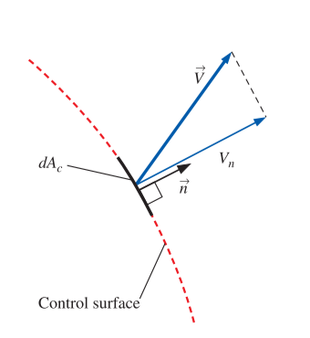
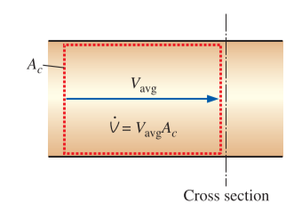
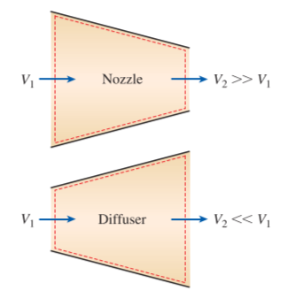
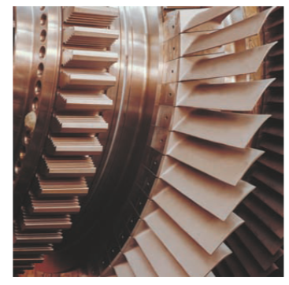
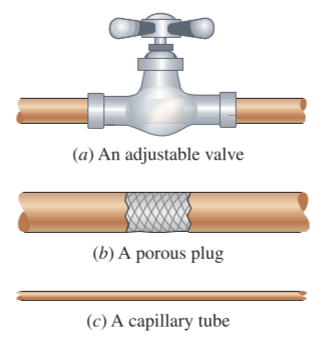
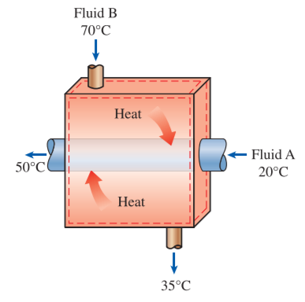
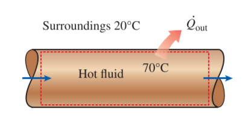

# CH_5

[TOC]

## 5.1 Conversion of Mass

### Mass and Volume Flow Rates

#### mass flow rate

$$
\delta\dot{m}=\rho V_n \mathrm{d} A_c\\[2ex]
\dot{m}=\int_{A_c}{\delta\dot{m}}=\int_{A_c}{\rho V_n\mathrm{d}A_c}\\[2ex]
\dot{m}=\rho V_{avg}A_c
$$

#### average velocity

$$
V_{avg}=\frac{1}{A_c}\int_{A_c}{V_n\mathrm{d}A_c}
$$

#### volume flow rate

$$
\dot{V}=\int_{A_c}{V_n]\mathrm{d}A_c}=V_{avg}A_c = VA_c
$$

$$
\dot{m}=\rho \dot{V}=\frac{\dot{V}}{\nu}
$$

### Conversion of Mass Principle

#### mass balance

$$
m_{in}-m_{out}=\Delta m_{CV}\\[2ex]
\dot{m}_{in}-\dot{m}_{out}= \frac{\mathrm{d}m_{CV}}{\mathrm{d}t}\\[2ex]
$$

#### general conversion of mass

$$
\frac{\mathrm{d}}{\mathrm{d}t}\int_{CV}{\rho \mathrm{d}V}+\int_{CS}{\rho (\vec{V}\cdot \vec{n})\mathrm{d}A}=0\\[2ex]
\frac{\mathrm{d}}{\mathrm{d}t}\int_{CV}{\rho \mathrm{d}V}=\sum_{in}{\dot{m}}-\sum_{out}{\dot{m}}\qquad \frac{\mathrm{d}m_{CV}}{\mathrm{d}t}=\sum_{in}{\dot{m}}-\sum_{out}{\dot{m}}
$$

### Mass Balance for Steady-Flow Processes

$$
\sum_{in}{\dot{m}}=\sum_{out}{\dot{m}}\\[2ex]
\rho_1V_1A_1 = \rho_2 V_2 A_2
$$

### Special Case: Incompressible Flow

$$
\sum_{in}{\dot{\nu}_1}=\sum_{out}{\dot{\nu}_2}\\[2ex]
V_1A_1 = V_2 A_2
$$

## 5.2 Flow Work and the Energy of a Flowing Fluid

$$
w_{flow}=Pv
$$

### Total Energy of a Flowing Fluid

the energy for the unit mass

$$
e = u + ke + pe = u + \frac{V^2}{2}+gz\\[2ex]
$$

for the flowing fluid

$$
\theta = Pv +e =(Pv+u)+ke+pe=h +\frac{V^2}{2}+gz
$$

### Energy Transport by Mass

- Amount of energy transport: $E_{mass}=m\theta=m(h +\frac{V^2}{2}+gz)$
- Rate of Energy transport: $\dot{E}_{mass}=\dot{m}\theta=\dot{m}(h +\frac{V^2}{2}+gz)$

$$
E_{in,mass}=\int_{m_i}{\theta_i\delta m_i}=\int_{m_i}{(h_i+\frac{V_i^2}{2}+gz_i)\delta m_i}
$$

## 5.3 Energy Analysis of Steady-Flow Systems

$$
\dot{E}_{in}=\dot{E}_{out}\\[2ex]
\dot{Q}-\dot{W}=\dot{m}[h_2-h_1+\frac{V_2^2-V_1^2}{2}+g(z_2-z_1)]
$$

- $\dot{Q}$: rate of heat transfer between the control volume and its surroundings
- $\dot{W}$: power
- $\Delta h$: $h_2-h_1$, the enthalpy change of a fluid
- $\Delta ke$: $(V_2^2-V_1^2)/2$, the kinetic energy change
- $\Delta pe$: $g(z_2-z_1)$, the potential energy change

## 5.4 Some Steady-Flow Engineering Devices

### 1 Nozzles and Diffusers

- $\dot{Q}\approx 0$
- $\dot{W}=0$
- $\Delta pe\approxeq 0$
- $\Delta ke \neq 0$

#### Nozzle

a device that **increases the velocity of a fluid** at the expense of the pressure

#### Diffuser

a device that **increases the pressure of a fluid** by slowing it down

### 2 Turbines and Compressors

- $\dot{Q}\approx 0$
- $\dot{W}\neq 0$
- $\Delta pe\approxeq 0$
- $\Delta ke \approxeq 0$

#### Fan

increases the pressure of a gas slightly and is mainly used to mobilize a gas

#### Compressor

is capable of compressing the gas to very high pressures

#### Pumps

work very much like compressors except that they handle liquids instead of gases

### 3 Throttling Valves

any kind of slow-restricting devices devices that cause a significant pressure drop in the fluid without involving any work

- $\dot{Q}\approx 0$
- $\dot{W}=0$
- $\Delta pe\approxeq 0$
- $\Delta ke \approxeq 0$

### 4a Mixing Chambers

the section where the mixing process takes place is commonly referred to as a mixing chamber

- $\dot{Q}\approx 0$
- $\dot{W}=0$
- $\Delta pe\approxeq 0$
- $\Delta ke \approxeq 0$

### 4b Heat Exchanges

heat exchanges are device where two moving fluid streams exchange heat without mixing

- $\dot{Q}$ varies
- $\dot{W}=0$
- $\Delta pe\approxeq 0$
- $\Delta ke \approxeq 0$

### 5 Pipe and Duct Flow

