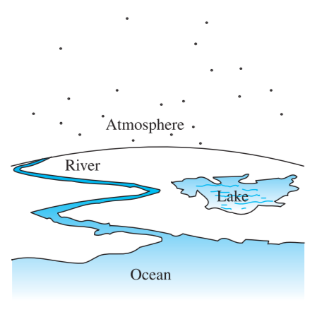
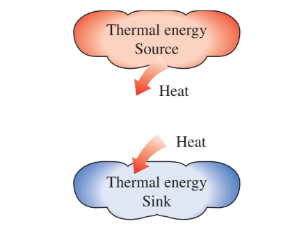
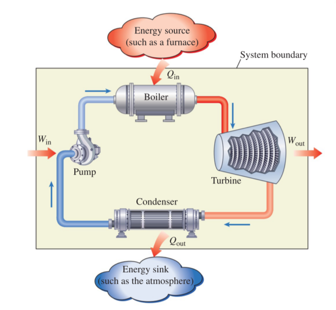
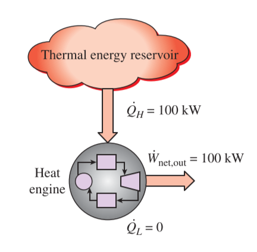
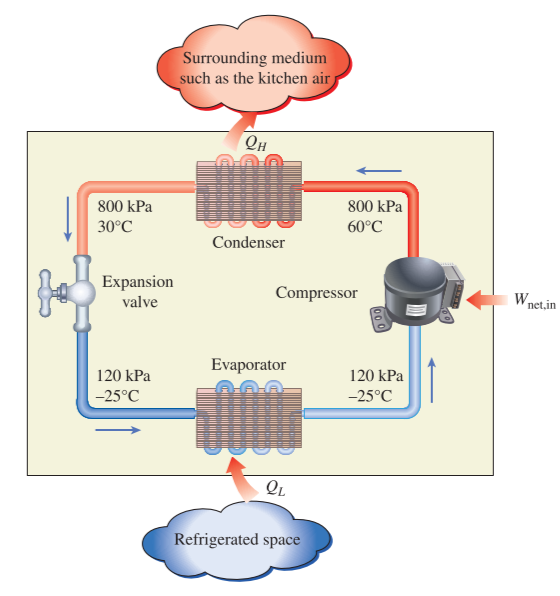

# CH_6

[TOC]

## 6.1 Introduction to the Second Law

Since satisfying the first law **does not ensure that the process can actually occur**, *the second law of thermodynamics* is introduced to identify whether a process can actually occur

- identify the **direction** od processes
- assert that energy has **quality** as well as **quantity**
- determine the **theoretical limits** for the performance of commonly used engineering systems
-  predicting the degree of completion of chemical reactions
-  quantify **the level of perfection** of a process
-  point the direction to **eliminate imperfections** effectively

## 6.2 Thermal Energy Reservoirs

### Definition

a hypothetical body with **a relatively large thermal energy capacity** that can supply or absorb finite amounts of heat *without undergoing any change in temperature*

- **Source**: a reservoir that supplies energy (heat)
- **Sink**: a reservoir that absorbs energy (heat)
  

## 6.3 Heat Engines

### Definition

the special devices that convert heat to work

### Characterization

1. they receive heat from a high-temperature source
2. they convert part of this heat to work
3. they reject the remaining waste to a low-temperature sink
4. they operate on a cycle

### Working Fluid

the fluid that transfers heat while undergoing a cycle

- $Q_{in}$: amount of heat supplied to steam in boiler from a high=temperature source
- $Q_{out}$: amount of heat rejected from steam in condenser to a low-temperature sink
- $W_{out}$: amount of work delivered by steam as it expands in turbine
- $W_{in}$: amount of work required to compress water to boiler pressure

$$
W_{net,out}=W_{out}-W_{in}
$$

### Thermal Efficiency

the fraction of the heat input that is converted to net work output, which is a measure of the performance of a heat engine

$$
\text{Thermal Efficiency} = \frac{\text{Net Work Output}}{\text{Total Heat Input}}\\[2ex]
\eta_{th}=\frac{W_{net,out}}{Q_{in}}\\[2ex]
\eta_{th}=1-\frac{Q_{out}}{Q_{in}}\\[2ex]
$$

### The Second Law of Thermodynamics: Kelvin-Planck Statement

>**It is impossible for any device that operates on a cycle to receive heat from a single reservoir and produce a net amount of work**

## 6.4 Refrigerators and Heat Pumps

**refrigerators**: the device which transfer heat from a low-temperature medium to a high-temperature one

### Coefficient of Performance

the efficiency of a refrigerator is expressed in terms of the coefficient of performance

$$
COP_R = \frac{Desired\;Output}{Required\;Input} = \frac{Q_L}{W_{net,in}}\\[2ex]
COP_R = \frac{Q_L}{Q_H-Q_L}=\frac{1}{Q_H/Q_L-1}
$$

### Heat Pumps

the device that transfer heat from a low-temperature medium to a high-temperature one

$$
COP_{HP} = \frac{Desired\;Output}{Required\;Input} = \frac{Q_H}{W_{net,in}}\\[2ex]
COP_{HP} = \frac{Q_H}{Q_H-Q_L}=\frac{1}{1-Q_L/Q_H}\\[2ex]
COP_{HP}=COP_R+1
$$

### The Second Law of Thermodynamics: Clausius Statement

>**It is impossible to construct a device that operates in a cycle and produces no effect other than the transfer of heat from a lower-temperature body to a higher-temperature body**

## 6.5 Perpetual-Motion Machine

Any devices that violates either law of thermodynamics is called a perpetual-motion machine

- PMM1: violate the first law of thermodynamics
- PMM2: violate the second law of thermodynamics