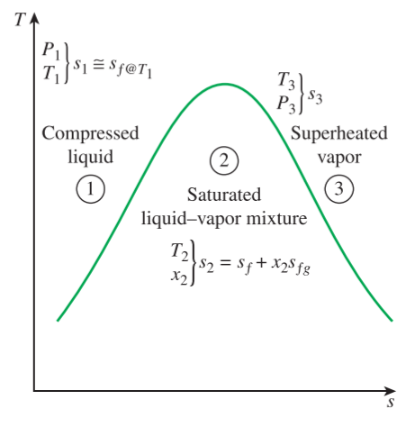

# CH_7

[TOC]

## 7.1 Entropy

### Clausius Inequality

$$
\oint{\frac{\mathrm{\delta} Q}{T}}\leq 0
$$

This inequality is valid for **all cycles**

And this property is named as **entropy**, which designated S and defined as

$$
\mathrm{d}S=\Big(\frac{\mathrm{\delta}Q}{T}\Big)_{int\;rev}
$$

The entropy of a system during a process can be determined by integrating between the initial and the final states

$$
\Delta S = S_2-S_1 = \int_1^2{\Big(\frac{\mathrm{\delta}Q}{T}\Big)_{int\;rev}}
$$

### Special Case: Internally Reversible Isothermal Heat Transfer Processes

$$
\Delta S = \int_1^2{\Big(\frac{\mathrm{\delta}Q}{T}\Big)_{int\;rev}} = \int_1^2{\Big(\frac{\mathrm{\delta}Q}{T_0}\Big)_{int\;rev}} = \frac{1}{T_0}\int_1^2{(\delta Q)_{int\; rev}}\\[2ex]
\Delta S = \frac{Q}{T_0}
$$

where $T_0$ is the constant temperature of the system and $Q$ is the heat transfer fo the internally reversible process

## 7.2 The Increase of Entropy Principle

$$
\oint{\frac{\mathrm{\delta}Q}{T}}\leq 0\\[2ex]
$$

or

$$
\int_1^2{\frac{\mathrm{\delta}Q}{T}}+\int_1^2{\Big(\frac{\mathrm{\delta}Q}{T}\Big)_{int\;rev}}\leq 0\\[2ex]
$$

while the second integral in the previous relation is recognized as the entropy change

$$
\int_1^2{\frac{\mathrm{\delta}Q}{T}}+S_1-S_2\leq 0\\[2ex]
S_2-S_1\geq \int_1^2{\frac{\mathrm{\delta}Q}{T}}\\[2ex]
$$

which can also be arranged as in differential form as

$$
\mathrm{d}S\geq\frac{\delta Q}{T}
$$

some entropy is generated or created during an irreversible process, which is due entirely to the presence of irreversibilities.

The entropy generated during a process is called **entropy generation** and is denoted by $S_{gen}$

$$
\Delta S_{sys}=S_2-S_1=\int_1^2{\frac{\mathrm{\delta Q}}{T}}+s_{gen}
$$

for an isolated system, the heat transfer is zero and the former equation reduces to

$$
\Delta S_{isolated}\geq 0
$$

The equation can be expressed as **the entropy of an isolated system during a process always increases or, in the limiting case of a reversible process, remains constant**. In other words, it _never_ decreases. This is known as the **increase of entropy principle**

$$
S_{gen} = \Delta S_{total}=\Delta S_{sys}+\Delta S_{surr}\geq 0
$$

Since the entropy change of a system can be negative during a process, but entropy generation cannot. The increase of entropy can be summarized as follows:

$$
S_{gen}
\begin{cases}
    > 0\;\text{Irreversible Process}\\[2ex]
    = 0\;\text{Reversible Process}\\[2ex]
    < 0\;\text{Impossible Process}\\[2ex]
\end{cases}
$$

## 7.3 Entropy Change of Pure Substances

The value of entropy at a specified state is determined just like any other property. Similarly, in the saturated mixture region, it's determined from

$$
s=s_f+xs_{fg}
$$

The entropy change of a specified mass m during a process is simply

$$
\Delta S = m\Delta s = m(s_1-s_1)
$$

## 7.4 Isentropic Processes

$$
\Delta s = 0\quad\text{or}\quad s_1=s_2
$$

It should be recognized that ***a reversible adiabatic process*** is necessarily ***isentropic*** ($s_2=s_1$), but an ***isentropic process*** **is not necessarily** a ***reversible adiabatic process***.