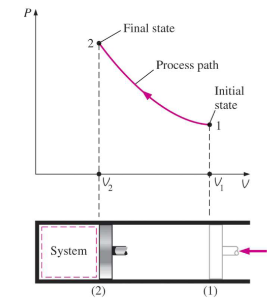
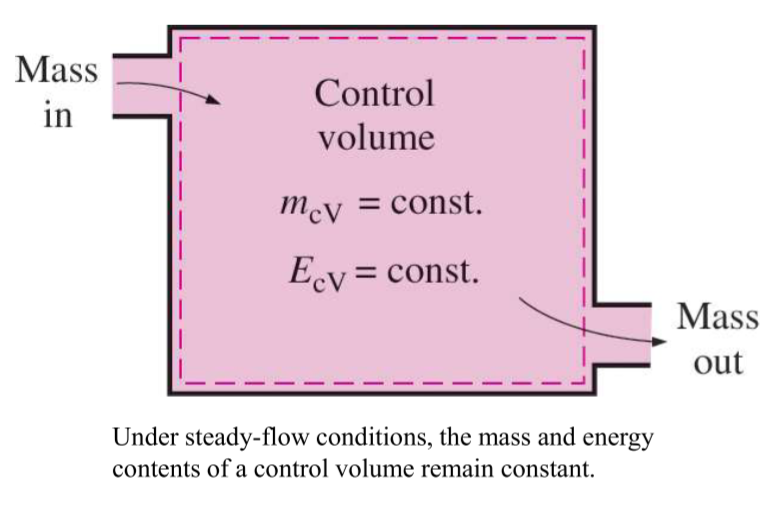
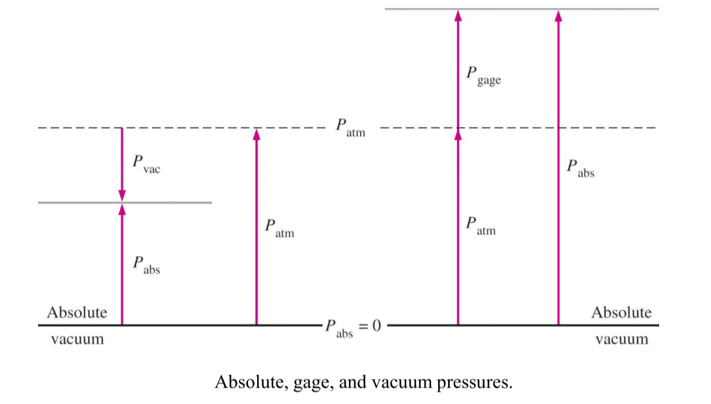

# Ch_1

[TOC]

## Thermodynamics and Energy

### conservation of energy principle

During an interaction, energy can change from one form to another but **the total amount of energy remains constant**

### the fundamental rules

- the zeroth law of thermodynamics
- the first law of thermodynamics
- the second law of thermodynamics
- the third law of thermodynamics

### research approach

- the macroscopic approach: **classical thermodynamics**
- the elaborate (microscopic) approach: **statistical thermodynamics**

## Systems and Control Volumes

### systems

a quantity of matter or a region in space chosen for study

- _surroundings_: the mass or region **outside** the system

- _boundary_: the real or imaginary surface that separates the system from its surroundings

        fixed/movable, real/imaginary

### classification of systems

- closed system (control mass: C.M.)

        no mass can enter or leave

- open system (control volume: C.V.)

        both mass and energy can cross boundary

- isolated system

        neither mass or energy can enter or leave

_non-isolated system + surroundings = isolated system_

**Simple Compressible System**

- one of the most important systems
- only transfer **heat** and **moving boundary work**

_moving boundary work_

- compression work
- expansion work

## Properties of a System

### classifications of properties

- intensive properties (independent of mass)

  pressure $p$, temperature $T$, density $\rho$

- extensive properties (depend on mass)

  mass $m$, volume $V$

_specific volume_

$$
v=\frac{V}{m}=\frac{1}{\rho}
$$

_specific gravity_

$$
SG=\frac{\rho}{\rho{H_2O}}
$$

### Basic State Properties

1. pressure $p$
2. temperature $T$
3. specific volume $v$

## State and Equilibrium (time)

- steady

  A system **may not be in equilibrium** when the system is **steady**.

  But a system **must be steady** when the system is **in equilibrium**.

- even (space)

  Equilibrium **is not necessarily** even.

  Single-phase equilibrium **must be** even

### Equilibrium Sate

- thermal equilibrium
- mechanical equilibrium
- phase equilibrium
- chemical equilibrium

### the State Postulate

**The state of a simple compressible system is completely specified by two independent, intensive properties.**

_The state of a simple system is completely specified by $r+1$ independent, intensive properties where $r$ is the number of significant work interactions_

## Process and Cycles

### Process Diagrams

- Ideal-Gas Equation of State

$$
pV=nRT
$$

- Process Diagram for a simple compressible system, $N=2$
  
  

### Quasi-equilibrium Process

- Process: any change that a system undergoes from one equilibrium state to another
- **Quasi-equilibrium Process**: a process proceeds in such a manner that the system remains infinitesimally close to an equilibrium state at all times

  
sufficient time to restore a new equilibrium

- The Steady-flow Process: a process during which a fluid flows through a control volume steadily
  
  

## Temperature and the Zeroth Law

### The Zeroth Law

**If two bodies are in thermal equilibrium with a third body, they are also in thermal equilibrium with each other**

_Therefore, the **temperature** becomes the only requirement for thermal equilibrium_

### Temperature Scales

- Kelvin scale (K)
- Celsius scale (C)
- Fahrenheit scale (F)
- Rankine scale (R)

$$
\begin{split}
T(K)&=T(C)+273.15 \\[2ex]
T(C)&=\frac{5}{9}(T(F)-32) \\[2ex]
T(F)&=T(R)-495.67 \\[2ex]
T(R)&=1.8T(K)
\end{split}
$$

- Ideal-gas temperature scale

$$
T=a+bP
$$

## Pressure

a normal force exerted by a fluid per unit area

$$
\begin{split}
&1\;kPa=10^3\;Pa\quad1\;bar = 10^5\;Pa\\[2ex]
&1\;Mpa=10^6\;Pa\\[2ex]
&1\;atm = 760\;mmHg=1.013 \times 10^5\;Pa\\[2ex]
&1\;mmHg = 133.3\;Pa\\[2ex]
&1\;kgf/cm^2=9.807\;N/cm^2=9.807\times10^4\;Pa
\end{split}
$$

### Absolute Pressure

the actual pressure at given point

### Gage Pressure

the difference between the absolute pressure and the local atmospheric pressure

### Vacuum Pressure

pressures below atmospheric pressure

$$
\begin{split}
&P_{gage}=P_{abs}-P_{atm}\\[2ex]
&P_{vac} = P_{atm}-P_{abs}
\end{split}
$$

