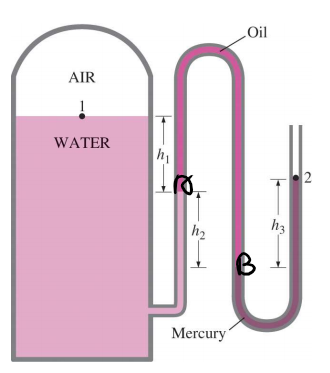

# EX_1

[TOC]

## EX 1.1

During a heating process, the temperature of a system rises by $10^\circ C$. Express this rise in temperature in $K$, $^\circ F$, and $R$

$$
\begin{aligned}
    \Delta K &= \Delta ^\circ C = 10 K\\[2ex]
    \Delta R &= \ 1.8 \Delta ^\circ C = 18R \\[2ex]
    \Delta ^\circ F &= \Delta R = 18 ^\circ F
\end{aligned}
$$

## EX 1.2

A vacuum gage connected to a chamber reads $5.8$ psi at a location where the atmospheric pressure is $14.5$ psi. Determine the absolute pressure in the chamber

$$
\begin{aligned}
    P_{vac} &= P_{atm}-P_{atm}\\[2ex]
            &= 14.5 - 5.8 = 8.7 psi
\end{aligned}
$$

## EX 1.3

The water in a tank is pressurized by air, and the pressure is measured by a multifluid-manometer as shown in the following figure. The tank is located on a mountain where the atmospheric pressure is $85.6\;kPa$.

Determine the air pressure in the tank if $h_1=0.1\;m$, $h_2=0.2\;m$, and $h_3 = 0.35\;m$. Take the densities of water, oil, and mercury to be $1000\; kg/m^3$, $850\;kg/m^3$, and $13,600\;kg/m^3$, respectively.

$$
\begin{cases}
    P_A = P_1 + \rho_w g h_1\\[2ex]
    P_B = P_A + \rho_o g h_2\\[2ex]
    P_B = P_2 + \rho_m g h_3\\[2ex]
\end{cases}
$$

$$
\begin{aligned}
    \Longrightarrow P_1 &= P_2+\rho_m gh_3-\rho_wgh_1 -\rho_O gh_2\\[2ex]
        &= 129.65 kPa 
\end{aligned}
$$