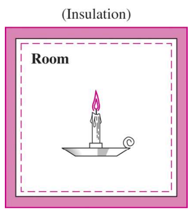
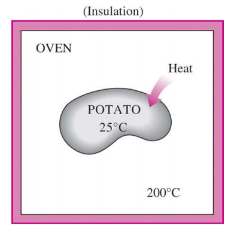
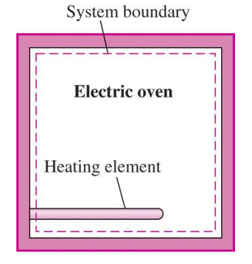
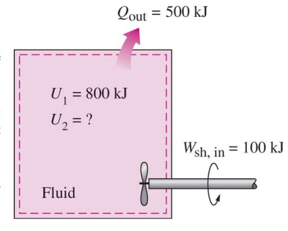
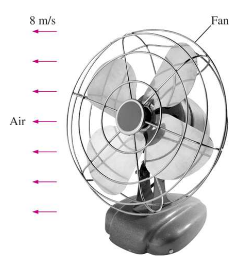

# EX_2

[TOC]

## EX 2.1

A site evaluated for a wind farm is observed to have steady winds at a speed of $8.5\;m/s$. 

Determine the wind energy (a) per unit mass, (b) for a mass of $10\;kg$, and (c) for a flow rate of $1154\;kg/s$ for air.

### (a)

$$
\begin{aligned}
    e = ke = \frac{V^2}{2}=36.125 J/kg
\end{aligned}
$$

### (b)

$$
\begin{aligned}
    E = KE = \frac{1}{2}mV^2 = 361.25 J
\end{aligned}
$$

### (c)

$$
\begin{aligned}
    \dot{E} = \dot{m}\cdot ke = 41688.25 J/s = 41.7 kW 
\end{aligned}
$$

## EX 2.2

A candle is burning in a well-insulated room. Taking the room (the air plus the candle) as the system.

Determine (a) if there is any heat transfer during this burning process and (b) if there is any change in the internal energy of the system

### (a)

since the system includes air and the candle while there lied an isolation around the system, there's no heat transfer during the burning process

### (b)

since the system includes air and the candle, the heat change of the total system remains 0

## EX 2.3

A potato initially at room temperature 25°C is being baked in an oven that is maintained at 200°C. Is there any heat transfer during this baking process?

- if taking the potato as the system: there's heat transfer in the process
- if taking the oven as the system: there's no heat transfer in the process

## EX 2.4

A well-insulated electric oven is being heated through its heating element. If the entire oven, including the heating element, is taken to be the system, determine whether this is a heat or work interaction.

> This energy transfer to the oven is not caused by a temperature difference between the oven and the surrounding air. Instead, it is caused by electrons crossing the system boundary and thus doing work. Therefore, this is a work interaction.

## EX 2.5

Answer the question in EX 2.4 if the system is taken as only the air in the oven without the heating element.

> This energy transfer to the oven is caused by a temperature difference between the interior of the oven and the surrounding air. Therefore, this is a heat transfer

## EX 2.6

A rigid tank contains a hot fluid that is cooled while being stirred by a paddle wheel. Initially, the internal energy of the fluid is $800\;kJ$. 

During the cooling process, the fluid loses 500 kJ of heat, and the paddle wheel does $100\;kJ$ of work on the fluid. Determine the final internal energy of the fluid. Neglect the energy stored in the paddle wheel

$$
\begin{aligned}
    W_{in} + U_1 &= Q_{out} + U_2\\[2ex]
    U_2 &= W_{in} + U_1 - Q_{out}\\[2ex]
    &= 800 + 100 - 500\\[2ex]
    &= 400 kJ 
\end{aligned}
$$

## EX 2.7

A fan that consumes $20\;W$ of electric power when operating is claimed to discharge air from a ventilated room at a rate of $1.0\;kg/s$ at a discharge velocity of $8\;m/s$ in the following figure. Determine if this claim is reasonable.

$$
\begin{aligned}
    P &= \frac{1}{2}\dot{m}V^2\\[2ex]
      &= \frac{1}{2}\cdot 1 \cdot 64\\[2ex]
      &= 32 W > 20 W
\end{aligned}
$$

impossible

## EX 2.8

The water in a large lake is to be used to generate electricity by the installation of a hydraulic turbine–generator at a location where the depth of the water is 50 m. Water is to be supplied at a rate of 5000 kg/s. If the electric power generated is measured to be 1862 kW and the generator efficiency is 95 percent.

Determine (a) the overall efficiency of the turbine–generator, (b) the mechanical efficiency of the turbine, and (c) the shaft power supplied by the turbine to the generator.

### (a)

$$
\begin{aligned}
    \eta_{all} &= \frac{P}{\dot{m}gh}\\[2ex]
               &= \frac{1862}{5\times 9.81\times 50}\\[2ex]
               &= 0.76
\end{aligned}
$$

### (b)

$$
\begin{aligned}
    \eta_{mec} &= \frac{\eta_{all}}{\eta_{gen}}= \frac{0.76}{0.95}\\[2ex]
               &= 0.80
\end{aligned}
$$

### (c)

$$
\begin{aligned}
    \dot{W}_{shaft} &= \dot{m}gh \cdot \eta_{mec}\\[2ex]
                    &= 1962 kW
\end{aligned}
$$