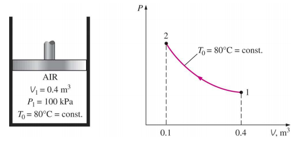

# EX_4

[TOC]

## EX 4.1

A piston-cylinder device initially contains $0.4\;m^3$ of air at $100\; kPa$ and at $80^{\circ}C$. The air is now compressed to $0.1\; m^3$ in such a way that the temperature inside the cylinder remains constant.

Determine the work done during this process

since the process is a process where the temperature remains the constant

$$
\begin{aligned}
    PV &= nRT\\[2ex]
    nR &= \frac{P_1V_1}{T_0}\\[2ex]
    W &= \int{nRT_0 \frac{1}{V}\mathrm{d}V}\\[2ex]
      &= -P_1V_1 \ln{\frac{V_1}{V_2}}\\[2ex]
      &= -100\;kPa \times 0.4\;m^3 \times \ln{4}\\[2ex]
      &= -55.45\; kJ
\end{aligned}
$$

## EX 4.2

A rigid tank is divided into two equal parts by a partition. Initially, one side of the tank obtains $5\;kg$ of water at $200\; kPa$ and $25^\circ C$, and the other side is evacuated. The partition is then removed, and the water extends into the entire tank. The water returns to the initial value of $25^\circ C$

Determine (a) the volume of the tank, (b) the final pressure, and (c) the heat transfer for this process

### (a)

Finding the data of the Table A-4 on p.904, we can get the water is in compressed situation, find $v_f = 0.001003 m^3/kg$

$$
\begin{aligned}
    V_1 &= m v_f = 5\times 0.001 = 0.005 m^3\\[2ex]
    V_2 &= 2V_1 = 0.01 m^3
\end{aligned}
$$

### (b)

$$
v_2 = \frac{0.01}{5} = 0.002\;m^3/kg
$$

which is in the range of the $v_f$ and $v_g$, which is the saturated water, therefore, the pressure is $P_{sat} = 3.1698 kPa$

### (c)

$$
\begin{aligned}
    0.001003 x + 43.340(5-x) &= 0.01\\[2ex]
    x &= 4.999885\;kg\\[2ex]
    U_1 &= m\cdot u_f = 5\; kg\times 104.83\; kJ/kg = 524.15\;kJ\\[2ex]
    U_2 &= x \cdot 104.83+ (5-x)\cdot 2409.1 = 524.41\;kJ\\[2ex]
    Q_{in} &= U_2 - U_1 = 0.26\; kJ
\end{aligned}
$$

## EX 4.3

Air at $300\;K$ and $200\; kPa$ is heated at constant pressure to $600\; K$. Determine the change in internal energy of air per unit mass, using (a) data from the table (Table A-17), (b) the functional form of the specific heat (Table A-2c), and (c) the average specific heat value (Table A-2b)

### (a)

$$
\begin{aligned}
    \Delta u &= u_2 - u_1\\[2ex]
             &= 434.78 - 214.07\\[2ex]
             &= 220.71 kJ
\end{aligned}
$$

### (b)

$$
\begin{aligned}
    \bar{c}_p &= a+bT+cT^2+dT^3\\[2ex]
    \Delta \bar{u} &= \int_{T_1}^{T_2}{(\bar{c}_p-R_u)\mathrm{d}T}\\[2ex]
             &= \Big[(a-R_u)T +\frac{1}{2}bT^2+\frac{1}{3}cT^3+\frac{1}{4}dT^4\Big]_{300}^{600}\\[2ex]
             &= \Big[19.80T +\frac{1}{2}\times 0.1967\times 10^{-2}T^2+\frac{1}{3}\times0.4802\times10^{-5} T^3-\frac{1}{4}\times1.966\times 10^{-9}T^4\Big]_{300}^{600}\\[2ex]
             &= 6447.01 kJ/mol\\[2ex]
    \Delta u &= \frac{\Delta \bar{u}}{M} = \frac{6447.01}{28.97} = 222.54 kJ
\end{aligned}
$$

### (c)

$$
\begin{aligned}
    \Delta u &= c_{v,avg}\Delta T\\[2ex]
             &= 0.733\times 300\\[2ex]
             &= 219.9 kJ\\[2ex]
\end{aligned}
$$