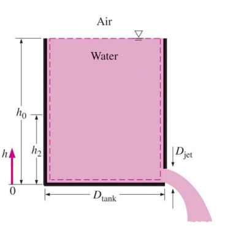
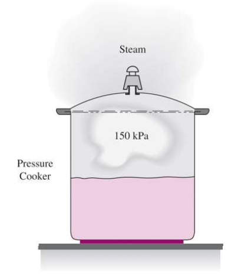
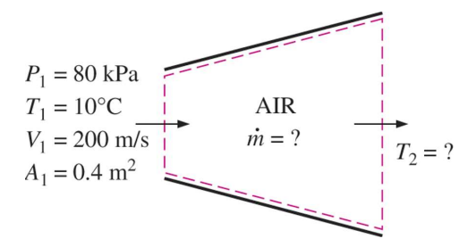
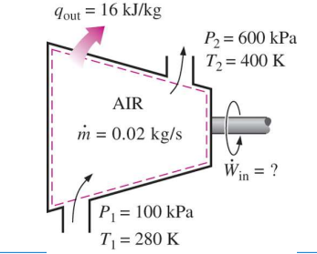
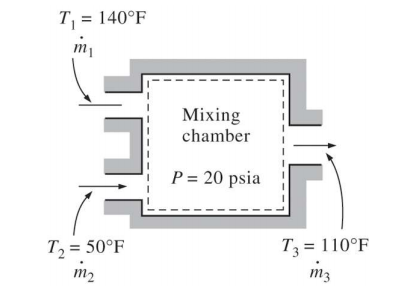
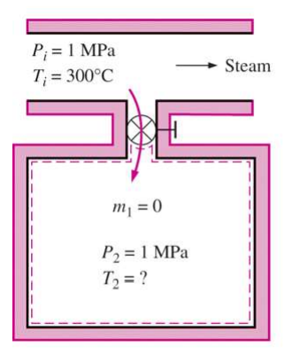

# EX_5

[TOC]

## EX 5.1

A garden hose attached with a nozzle is used to fill a 10-gal bucket. The inner diameter of the hose is $2\;cm$, and it reduces to $0.8\;cm$ at the nozzle exit. If it takes $50\;s$ to fill the bucket with water.

Determine (a) the volume and mass flow rates of water through the hose, and (b) the average velocity of water at the nozzle exit.

### (a)

$$
\begin{aligned}
    \dot{V} &= \frac{V}{\Delta t} = \frac{10\; gal}{50\; s}\cdot\frac{3.7854\; L}{1\; gal}\\[2ex]
    &= 0.757\; L/s\\[2ex]
    \dot{m} &= \rho \dot{V}\\[2ex]
            &= 1kg/L\times 0.757L/s = 0.757 kg
\end{aligned}
$$

### (b)

$$
\begin{aligned}
    \dot{V} &= v S\\[2ex]
    v &= \frac{\dot{V}}{S} = \frac{7.57\times 10^{-5} m^3/s}{\frac{1}{4}\pi (8\times 10^{-2})^2m^2} = 15.06 m/s
\end{aligned}
$$

## EX 5.2

A 4-ft-high, 3-ft-diameter cylindrical water tank whose top is open to the atmosphere is initially filled with water. Now the discharge plug near the bottom of the tank is pulled out, and a water jet whose diameter is $0.5\;in$ stream out. The average velocity of the jet is given by $V = \sqrt{2gh}$ where h is the height of water in the tank measured from the center of the hole (a variable) and g is the gravitational acceleration.

Determine how long it will drop to $2\;ft$ from the bottom.

$$
\begin{aligned}
    \dot{m}_{in} -\dot{m}_{out} &= \frac{\mathrm{d}m_{cv}}{\mathrm{d}t}\\[2ex]
    -\dot{m}_{out} &= \frac{\mathrm{d}m_{cv}}{\mathrm{d}t}\\[2ex]
    \rho A_{jet}\sqrt{2gh} &= \frac{\mathrm{d}(\rho A_{tank}h)}{\mathrm{d}t}\\[2ex]
    \mathrm{d}t &= \frac{1}{\sqrt{2g}}\cdot \frac{A_{tank}}{A_{jet}}\cdot \frac{\mathrm{d}h}{\sqrt{h}}\\[2ex]
    t &= \frac{1}{\sqrt{2g}}\cdotp\frac{D_{tank}^2}{D_{jet}^2}\int_{h_1}^{h_2}{\frac{\mathrm{d}h}{\sqrt{h}}}\\[2ex]
    &= \sqrt{\frac{2}{g}} \cdotp\frac{D_{tank}^2}{D_{jet}^2}(\sqrt{h_1}-\sqrt{h_2})\\[2ex]
    &= 756.8 s
\end{aligned}
$$

## EX 5.3

Steam is leaving a $4\;L$ pressure cooker whose operating pressure is $150\;kPa$. It is observed that the amount of liquid in the cooker has decreased by $0.6\;L$ in $40\;min$ after the steady operating conditions are established, and the cross-sectional area of the exit opening conditions are established, and the cross-sectional area of the exit opening is $8\;mm^2$.

Determine (a) the mass flow rate of the steam and exit velocity, (b) the total and flow energies of the steam per unit mass, and (c) the rate by steam

### (a)

$$
\begin{aligned}
    \Delta m &= \frac{0.6 L}{v_f}= \frac{0.0006 m^3}{0.001053 kg/m^3} = 0.57 kg\\[2ex]
    \dot{m} &= \frac{\Delta m}{\Delta t} = \frac{0.57 kg}{40 min} = 2.375\times 10^{-4} kg/s\\[2ex]
    v &= \frac{\dot{m}}{\rho_{air}A} = \frac{\dot{m} v_g}{A} = \frac{2.375\times 10^{-4}kg/s\times1.1594}{8\times 10^{-6}} = 34.42 m/s
\end{aligned}
$$

### (b)

$$
\begin{aligned}
    \theta &= h + ke + pe\\[2ex]
           &= h + v^2/2 = 2936.1 + 0.592 \approxeq 2936.7kJ
\end{aligned}
$$

### (c)

$$
\begin{aligned}
    \dot{E}_{mass} &= \dot{m} \theta = 0.697 kW 
\end{aligned}
$$

## EX 5.4

Air at $10^\circ C$ and $80\; kPa$ enters the diffuser of a jet engine steadily with a velocity of $200\; m/s$. The inlet area of the diffuser is $0.4\; m^2$. The air leaves the diffuser with a velocity that is very small compared with the inlet velocity.

Determine (a) the mass flow rate of the air and (b) the temperature of the air leaving the diffuser.

### (a)

$$
\begin{aligned}
    P_1V &= mRT_1\\[2ex]
    v_1 &= \frac{V}{m} =\frac{RT_1}{P_1} = \frac{0.2870 kJ/kg \cdot K \times 283.15K}{80 kPa}\\[2ex]
    &= 1.016 m^3/kg\\[2ex]
    \dot{m} &= \frac{A_1V_1}{v_1}=\frac{0.4 m^2\times 200m/s}{1.016 m^3/kg}= 78.74 kg/s
\end{aligned}
$$

### (b)

according to the model of the nozzle, the internal energy remain the same during the process. 

Therefore, $h_1+ke_1=h_2+ke_2$

$$
\begin{aligned}
    h_1 &= 283.14 kJ/kg\\[2ex]
    ke_1 &= V_1^2/2 = 20 kJ/kg\\[2ex]
    ke_2 &\approxeq 0kJ/kg\\[2ex]
    h_2 &= 303.14 kJ/kg\\[2ex]
\end{aligned}
$$

where the temperature of the enthalpy equals to $302.9 K$

## EX 5.5

Air at $100\;kPa$ and $280\;K$ is compressed steadily to $600\;kPa$ and $400\;K$. The mass flow rate of the air is $0.02\;kg/s$, and a heat loss of $16\;kJ/kg$ occurs during the process. Assuming the changes in kinetic and potential energies are negligible.

Determine the necessary power input to the compressor.

According to the model of the turbine, we could simply get the equation $h_1+Q_{out} = h_2+W$

$$
\begin{aligned}
    \dot{W} &= \dot{m}q_{out}+\dot{m}(h_2-h_1)\\[2ex]
            &= 0.02\times(16+400.98-280.13)\\[2ex]
            &= 2.737 kW
\end{aligned}
$$

## EX 5.6

Consider an ordinary shower where hot water at $140^\circ F$ is mixed with cold water at $50^\circ F$. If it is desired that a steady stream of warm water at $110^\circ F$ be supplied, determine the ratio of the mass flow rates of the hot to cold water. Assume the heat losses from the mixing chamber to be negligible and the mixing to take place at a pressure of $20\;psia$

since there's no change in the internal energy and all temperatures are below the saturated temperature, we can get the conclusion that $\dot{m}_1h_1+\dot{m}_2h_2 = \dot{m}_3h_3$

$$
\begin{aligned}
    \dot{m}_1h_1+\dot{m}_2h_2 &= (\dot{m}_1+\dot{m}_2)h_3\\[2ex]
    \frac{\dot{m}_1}{\dot{m}_2}h_1+h_2 &= (\frac{\dot{m}_1}{\dot{m}_2}+1)h_3\\[2ex]
    \frac{\dot{m}_1}{\dot{m}_2} &= \frac{h_3-h_2}{h_1-h_3} = \frac{136.26-121.875}{143.47-136.26} = 2.00
\end{aligned}
$$

## EX 5.7

A rigid, insulated tank that is initially evacuated is connected through a valve to a supply line that carries steam at $1\;MPa$ and $300^\circ C$. Now the valve is opened, and steam is allowed to flow slowly into the tank until the pressure reaches $1\;MPa$, at which point the valve is closed.

Determine the final temperature of the steam in the tank.

$$
\begin{aligned}
    m_{in}+m_1 &= m_2\\[2ex]
    m_{in}h_1 &= m_2u_2\\[2ex]
    u_2 &= h_2 = 3051.6 kJ/kg\\[2ex]
\end{aligned}
$$

according to the table on Table A-6, get that the temperature equals to $456.07 K$