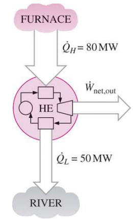
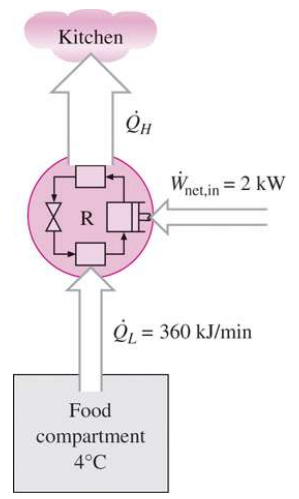
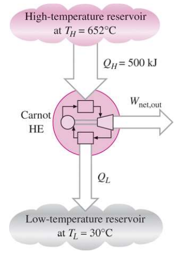
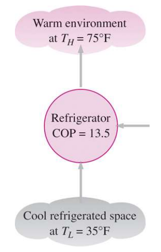
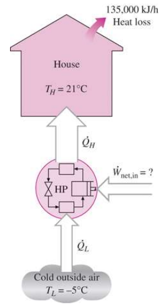

# EX_6

[TOC]

## EX 6.1

Heat is transferred to a heat engine from a furnace at a rate of $80\;MW$. If the rate of waste heat rejection to a nearby river is $50\;MW$, determine the net power output and the thermal efficiency for this heat engine.

$$
\begin{aligned}
    \dot{W}_{out} &= \dot{Q}_H-\dot{Q}_L = 30 MW\\[2ex]
    \eta_{th} &= \frac{\dot{W}_{out}}{\dot{Q}_H} = 0.375
\end{aligned}
$$

## EX 6.2

The food compartment of a refrigerator is maintained at $4^{\circ}C$ by removing heat from it at a rate of $360\;kJ/min$. If the required power input to the refrigerator is $2\; kW$, determine (a) the coefficient of performance of the refrigerator and (b) the rate of heat rejection to the room that houses the refrigerator

### (a)

$$
\begin{aligned}
    COP_{R} &= \frac{\dot{Q}_L}{\dot{W}_{in}}=\frac{6 kW}{2 kW} = 3\\[2ex]
\end{aligned}
$$

### (b)

$$
\begin{aligned}
    \dot{Q}_H &= \dot{W}_{in}+\dot{Q}_L = 8 kW\\[2ex]
\end{aligned}
$$

## EX 6.3

A Carnot heat engine, shown in the following figure, receives $500\;kJ$ of heat per cycle from a high temperature source at $652^{\circ}C$ and rejects heat to a low-temperature sink at $30^{\circ}C$.

Determine (a) the thermal efficiency of this Carnot engine and (b) the amount of heat rejected to the sink per cycle.

### (a)

$$
\eta_{th} = 1- \frac{T_L}{T_H} = 1-\frac{30+273.15}{652+273.15}=67.23\%
$$

### (b)

$$
Q_L = \frac{T_L}{T_H}Q_H = \frac{30+273.15}{652+273.15} \times 500 = 163.84 kJ
$$

## EX 6.4

An inventor claims to have developed a refrigerator that maintains the refrigerated space at $35^\circ F$ while operating in a room where the temperature is $75^\circ F$ and that has a $COP$ of $13.5$. Is this claim reasonable?

$$
\begin{aligned}
    COP_{R} &= \frac{Q_L}{Q_H-Q_L}= \frac{1}{\frac{Q_H}{Q_L}-1}=\frac{1}{\frac{T_H}{T_L}-1} = \frac{1}{\frac{75+460}{35+460}-1} = 12.375<13.5
\end{aligned}
$$

which is impossible

## EX 6.5

A heat pump is to be used to heat a house during the winter, as shown in the following figure. The house is to be maintained at $21^\circ C$ at all times. The house is estimated to be losing heat at a rate of $135000\; kJ/h$ when the outside temperature drops to $-5^\circ C$.

Determine the minimum power required to drive this heat pump.

$$
\begin{aligned}
    COP_{HP} &= \frac{\dot{Q}_H}{\dot{Q}_H-\dot{Q}_L}\\[2ex]
             &= \frac{1}{1-\frac{\dot{Q}_L}{\dot{Q}_H}} = \frac{1}{1-\frac{T_L}{T_H}}\\[2ex]
             &= \frac{1}{1-\frac{-5+273.15}{21+273.15}} = 11.31\\[2ex]
    \dot{W}_{in} &= \frac{\dot{Q}_{H}}{11.31} = 3.32 kW
\end{aligned}
$$