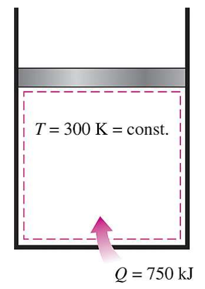

# EX_7

[TOC]

## EX 7.1

A piston–cylinder device contains a liquid–vapor mixture of water at $300\;K$. During a constant-pressure process, $750\;kJ$ of heat is transferred to the water. As a result, part of the liquid in the cylinder vaporizes. Determine the entropy change of the water during this process.

$$
\begin{aligned}
    \Delta S_{sys} &= \frac{Q}{T} = \frac{750}{300} = 2.5 kJ/K
\end{aligned}
$$

## EX 7.2

A heat source at 800 K loses 2000 kJ of heat to a sink at (a) 500 K and (b) 750 K.

Determine which heat transfer process is more irreversible.

### (a)

$$
\begin{aligned}
    \Delta S_{source} &= \frac{-Q}{T} = \frac{-2000}{800} = -2.5kJ/K\\[2ex]
    \Delta S_{sink} &= \frac{Q}{T} = \frac{2000}{500} = 4kJ/K\\[2ex]
    \Delta S &= \Delta S_{source}+\Delta S_{sink} =1.5 kJ/K
\end{aligned}
$$

### (b)

$$
\begin{aligned}
    \Delta S_{source} &= \frac{-Q}{T} = \frac{-2000}{800} = -2.5kJ/K\\[2ex]
    \Delta S_{sink} &= \frac{Q}{T} = \frac{2000}{750} = 2.67kJ/K\\[2ex]
    \Delta S &= \Delta S_{source}+\Delta S_{sink} = 0.17 kJ/K
\end{aligned}
$$

## EX 7.3

A rigid tank contains $5\;kg$ of refrigerant-134a initially at $20^{\circ}C$ and $140\; kPa$. The refrigerant is now cooled while being stirred until its pressure drops to $100\;kPa$. Determine the entropy change of the refrigerant during this process.

according to the pressure table on the Table A-13 on p.919, got the data of the superheated refrigerant-134a

$$
\begin{aligned}
    s_1 &= 1.0625\;kJ/kg\cdot K\\[2ex]
    v_1 &= 0.16544\;m^3/kg\\[2ex]
    v_f &= 0.0007258\; m^3/kg\\[2ex]
    v_g &= 0.19255\; m^3/kg\\[2ex]
    v_2 &= x\cdot v_g+(1-x)v_f\\[2ex]
    x &= 0.8587\\[2ex]
    s_f &= 0.07182\;kJ/kg\cdot K\\[2ex]
    s_g &= 0.95191\;kJ/kg\cdot K\\[2ex]
    s_2 &= x\cdot s_g+(1-x)\cdot s_f = 0.8276\; kJ/kg\cdot K\\[2ex]
    \Delta S &= m \cdot (s_2-s_1) = -1.1745 kJ/K
\end{aligned}
$$

## EX 7.4

Steam enters an adiabatic turbine at $5\; MPa$ and $450^\circ C$ and leaves at a pressure of $1.4\; MPa$. Determine the work output of the turbine per unit mass of steam if the process is reversible.

from the Table A-6 on p. 910, we can get the information of superheated water

$$
\begin{aligned}
    h_1 &= 3317.2 kJ/kg\\[2ex]
    s_1 &= 6.8210 kJ/kg\cdot K
\end{aligned}
$$

from the Table A-6 on p. 909, we can get the information of superheated water

$$
\begin{aligned}
    s_1 &= s_2\\[2ex]
    h_2 &= 2967.4 kJ/kg\\[2ex]
    w_{out} &= h_1-h_2 = 349.8 kJ/kg
\end{aligned}
$$

## EX 7.5

Liquid methane is commonly used in various cryogenic applications. The critical temperature of methane is $191\; K$(or $-82^\circ C$), and thus methane must be maintained below $191\; K$ to keep it in liquid phase. The properties of liquid methane at various temperatures and pressures are given in Table 7-1.

Determine the entropy change of liquid methane as it undergoes a process from $110\;K$ and $1\;MPa$ (a) using tabulated properties and (b) approximating liquid methane as an incompressible in the latter case

### (a)

from the Table 7-1 on p. 350, we can get the data of the compressed liquid water

$$
\begin{aligned}
    s_1 &= 4.875 kJ/kg\cdot K\\[2ex]
    s_2 &= 5.145 kJ/kg\cdot K\\[2ex]
    \Delta s &= s_2-s_1 = 0.270 kJ/kg\cdot K\\[2ex]
\end{aligned}
$$

### (b)

$$
\begin{aligned}
    c_{p1} &= 3.471 kJ/kg\cdot K\\[2ex]
    c_{p2} &= 3.486 kJ/kg\cdot K\\[2ex]
    c_{avg} &= \frac{c_{p1}+c_{p2}}{2} = 3.479 kJ/kg\cdot K\\[2ex]
    \Delta s &= c_{avg}\ln\big(\frac{T_2}{T_1}\big) = 0.303 kJ/kg\cdot K\\[2ex]
    error &= \frac{|\Delta s_2-\Delta s_1|}{\Delta s_1} = 12.22\%
\end{aligned}
$$

## EX 7.6

Air is compressed from an initial state of $100\;kPa$ and $17^\circ C$ to a final state of $600\;kPa$ and $57^\circ C$.

Determine the entropy change of air during this compression process by using (a) property values from the air table and (b) average specific heats.

### (a)

$$
\begin{aligned}
    \Delta s &= s_2-s_1 = s_2^0-s_1^0-R\ln\frac{P_2}{P_1}\\[2ex]
             &= 1.79783 kJ/kg\cdot K - 1.66802 kJ/kg\cdot K- 0.2870 \times \ln \frac{600}{100}\\[2ex]
             &= -0.3844 kJ/kg\cdot K
\end{aligned}
$$

### (b)

$$
\begin{aligned}
    \Delta s &= s_2-s_1 = c_{p,avg}\ln\frac{T_2}{T_1}-R\ln\frac{P_2}{P_1}\\[2ex]
             &= 1.0056\times\ln\frac{330}{290}-0.2870\times\ln\frac{600}{100}\\[2ex]
             &= -0.3843 kJ/kg\cdot K
\end{aligned}
$$

## EX 7.7

Air is compressed in as car engine from $22^\circ C$ and $95\; kPa$ in a reversible and adiabatic manner. If the compression ratio $V_1/V_2$ of this engine is $8$, determine the final temperature of the air.

$$
\begin{aligned}
    \frac{V_1}{V_2} &= \frac{v_{r1}}{v_{r2}}\\[2ex]
    v_{r2} &= \Big(\frac{V_2}{V_1}\Big)v_{r1} = \frac{1}{8}\times 647.9 = 80.9875
\end{aligned}
$$

where the temperature is $662.75\;K$

## EX 7.8

Determine the compressor work input required to compress steam isentropically from 100 kPa to 1 MPa, assuming that the steam exists as (a) saturated liquid and (b) saturated vapor at the inlet state.

### (a)

from the table A-5, got the data of the specific volume of the saturated water
$$
\begin{aligned}
    w &= \int{v_f\mathrm{d}P} = 0.001043\times (1000-100)\\[2ex]
      &= 0.94 kJ/kg
\end{aligned}
$$

### (b)

since the specific volume of the vapor would change hugely during compressing

$$
\begin{aligned}
    w &= h_2 - h_1\\[2ex]
    s_1 &= 7.3589\\[2ex]
    h_1 &= 2675.0 kJ/kg\\[2ex]
    s_2 &= s_1\\[2ex]
    h_2 &= 3194.5 kJ/kg\\[2ex]
    w &= 519.5 kJ/kg
\end{aligned}
$$

## EX 7.9

Air is compressed steadily by a reversible compressor from an inlet state of 100 kPa and 300 K to an exit pressure of 900 kPa. 

Determine the compressor work per unit mass for (a) isentropic compression with k =1.4, (b) polytropic compression with n =1.3, (c) isothermal compression, and (d) ideal two-stage compression with intercooling with a polytropic exponent of 1.3.

### (a) and (b)

$$
\begin{aligned}
    W_1 &= \frac{kRT_1}{k-1}\Bigg[\Big(\frac{P_2}{P_1}\Big)^{(k-1)/k}-1\Bigg]\\[2ex]
        &= 263.21 kJ/kg\\[2ex]
    W_2 &= \frac{nRT_1}{n-1}\Bigg[\Big(\frac{P_2}{P_1}\Big)^{(n-1)/n}-1\Bigg]\\[2ex]
        &= 246.4 kJ/kg
\end{aligned}
$$

### (c)

$$
\begin{aligned}
    W_3 &= RT\ln\frac{P_2}{P_1}\\[2ex]
        &= 189.18 kJ/kg
\end{aligned}
$$

### (d)

$$
\begin{aligned}
    P_x &= \sqrt{P_1P_2} = 300 kPa\\[2ex]
    W_4 &= 2\frac{nRT_1}{n-1}\Bigg[\Big(\frac{P_x}{P_1}\Big)^{(n-1)/n}-1\Bigg]\\[2ex]
        &= 215.3 kJ/kg
\end{aligned}
$$

## EX 7.10

Steam enters an adiabatic turbine steadily at 3 MPa and 400°C and leaves at 50 kPa and 100°C. If the power output of the turbine is 2 MW.

Determine (a) the isentropic efficiency of the turbine and (b) the mass flow rate of the steam flowing through the turbine.

### (a)

$$
\begin{aligned}
    h_1 &= 3231.7 kJ/kg\\[2ex]
    s_1 &= 6.9235 kJ/kg\\[2ex]
    h_{2s} &= 2407.85 kJ/kg\\[2ex]
    h_{2a} &= 2682.4 kJ/kg\\[2ex]
    \eta &= \frac{h_1-h_{2a}}{h_1-h_{2s}} = 66.8\%
\end{aligned}
$$

### (b)

$$
\begin{aligned}
    \dot{W} &= \dot{m}(h_1-h_{2a})\\[2ex]
    \dot{m} &= 3.64 kg/s
\end{aligned}
$$

## EX 7.11

Air is compressed by an adiabatic compressor from $100\;kPa$ and $12^\circ C$ to a pressure of $800\; kPa$ at a steady rate of $0.2\; kg/s$. 

If the isentropic efficiency of the compressor is 80 percent, determine (a) the exit temperature of air and (b) the required power input to the compressor.

### (a)

$$
\begin{aligned}
    h_1 &= 285.14 kJ/kg\\[2ex]
    P_{r1} &= 1.1584\\[2ex]
    \frac{P_{r1}}{P_{r2}} &= \frac{P_1}{P_2}\\[2ex]
    P_{r2} &= 9.2672\\[2ex]
    h_{2s} &= 517.05 kJ/kg\\[2ex]
    \eta &= \frac{h_{2s}-h_1}{h_{2a}-h_1} = 0.8 \\[2ex]
    h_{2a} &= 575.03 kJ/kg \longrightarrow T_{2a} = 569.5 K
\end{aligned}
$$

### (b)

$$
\begin{aligned}
    \dot{W} &= \dot{m}(h_{2a}-h_1) = 58.0 kW
\end{aligned}
$$